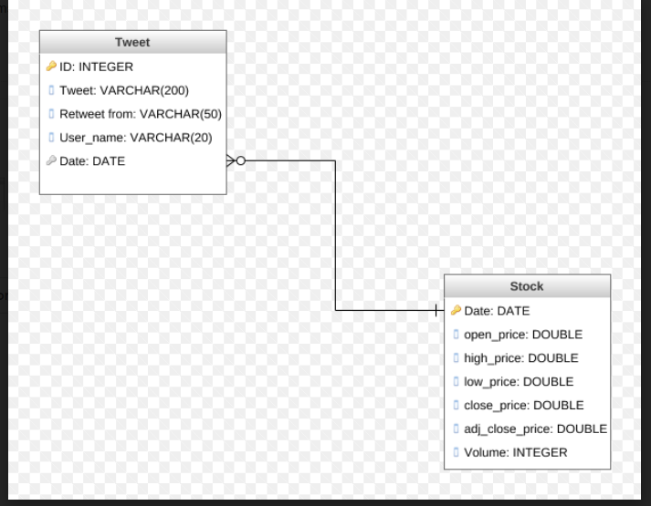
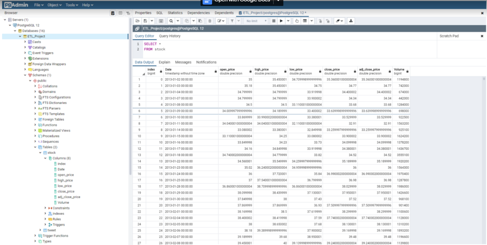
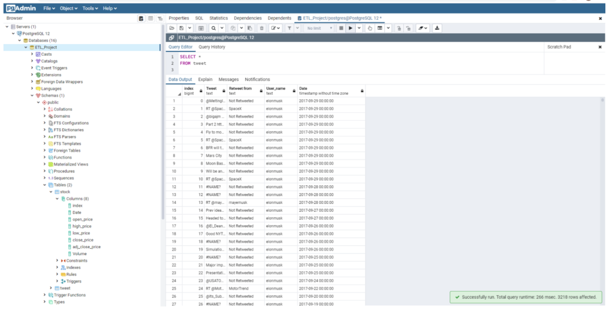

# ETL-Project

# Motivation
This is a group ETL project for the UO Data Analytics Bootcamp.  The purpose of this project is to
learn how to submit a Final Report that describes the following:
- Extract: your original data sources and how the data was formatted (CSV, JSON, pgAdmin 4, etc).
- Transform: what data cleaning or transformation was required.
- Load: the final database, tables/collections, and why this was chosen.

# Topic
How Elon Musks tweets affect TESLA stock prices.  One of Elon Musk's best tweets:
> Tesla Goes Bankrupt - Despite intense efforts to raise money, including a last-ditch mass sale of Easter Eggs, we are sad to report that Tesla has gone completely and totally bankrupt. So bankrupt, you can't believe it. There are many chapters of bankruptcy and, as critics so rightly pointed out, Tesla has them *all*, including Chapter 14 and a half (the worst one).

# Installation
1. Jupyter Notebook installation: (https://jupyter.org/install)
2. Pandas installation: `pip install pandas` or `conda install pandas`
3. Psycopg2 installation:  `pip install pyscopg2` or `conda install pyscopg2`
4. SQLAlchemy installation: `pip install SQLAlchemy` or `conda install -c anaconda sqlalchemy`
    pip installation: (https://docs.sqlalchemy.org/en/13/intro.html#install-via-pip)
    conda installtion: (https://anaconda.org/anaconda/sqlalchemy)
5. PostgreSQL installation:
   - Windows
     - To download PostgreSQL version 12.1 for Windows x86-64 from (http://enterprisedb.com/downloads/postgres-postgresql-downloads)
   - Mac
     - To download Postgres/pgAdmin installation from (https://oregon.bootcampcontent.com/Oregon_Coding_Bootcamp/UofO-POR-DATA-PT-12-2019-U-C/blob/master/04-Resources/PostgreSQL%20Installation/postgresinstallmac.md)

6. Other tools:
   - GenMyModel: (https://app.genmymodel.com/api/login)
   
  
# Methodology
  - Create ETL_Project database in PostgreSQL
  - In Jupyter Notebook:
    - Load Tweet_data and TSLA csv files into pandas using formatting "UTF-8"
    - TSLA cleaning process:   
      1. Change the "Date" column from object to datetime object
      2. Rename the following columns to avoid key word conflict in PostgresQL: "Open" to "open_price", "Close" to "close_price", "High" to "high_price", "adj close" to  "adj_close_price"
  
    - Tweet_data cleaning process:
      1. Separate time and date in "Time" column and create a new column called "Date"
      2. Change the Date column from object to datetime object 
      3. Change NAN values in "Retweet from" column to "Not Retweeted"
      4. Rename the following column to avoid key word conflict in PostgreSQL: "User" column to "User_name"
      5. Drop "row Id" column
  
  - Load dataframe into PostgreSQL

# Screenshot of ERD

# Code sample
To verify your data imported correctly from the csv file to PostgreSQL.  Use pgAdmin, go to the database (ETL_Project), right click on database name and select Query Tool.  Type the following select statement
in the query editor:
- `Select * From stock`
- `Select * From tweet`

# Screenshot of select statements

# Credits
@ NancyMathur
@ ChristianThomson
@ AngieOng

  